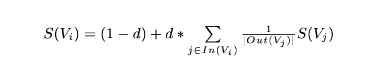
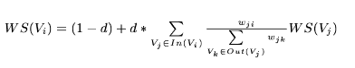

O projektu
==========

Svrha ove aplikacije je ekstrakcija ključnih reči i izraza iz teksta. Za
ekstrakciju se koristi TextRank algoritam (Mihalcea & Tarau, 2004), koji
predstavlja modifikaciju Goolge-ovog izvornog PageRank algoritma.
TextRank algoritam je zasnovan na grafu, odnosno predstavljanju teksta u
formi neusmerenog grafa, pri čemu se važnost reči u tekstu određuje na
osnovu povezanosti sa drugim rečima u okviru grafa, o čemu će više biti
reči kasnije. U ovom radu su implementirane dve verzije TextRank
algoritma, netežinska i težinska verzija. U prvom slučaju, reč se
povezuje sa rečima koje se nalaze unutar unapred zadatog „prozora“ od n
reči, ali svaka grana ima težinu 1, dok se u drugom slučaju takođe
povezuju reči unutar zadatog „prozora“, a ukoliko su dve reči već
povezane povećava se „težina“ postojeće grane. Nakon izbora verzije
algoritma i tekstualnog fajla (koji se zadaje preko relativne putanje) i
pokretanja main metode odgovarajuće klase, korisniku se ispisuju
ekstrahovane ključne reči za dati tekst. Usled nedostatka odgovarajućih
biblioteka za obradu teksta na srpskom jeziku, moguće je procesirati
samo tekstove na engleskom jeziku.

Postupak ekstrakcije
====================

Zadatak ekstrakcije ključnih reči i izraza se sastoji u automatskom
prepoznavanju reči i izraza koji najbolje opisuju dati tekst. Kao što je
napomenuto, implementirane su dve verzije TextRank algoritma. Međutim,
većina koraka obe verzije se poklapa, tako da je napravljena apstraktna
klasa ***TextRank***, koja sadrži zajedničke metode za obe verzije, i
klase ***UnweightedTextRank*** i ***WeightedTextRank***, koje
predstavljaju netežinsku i težinsku verziju algoritma, respektivno, i
koje implementiraju metode koje su specifične za tu verziju. U obe
verzije je korišćen neusmeren graf.

Postupak se sastoji od sledećih koraka:

> 1. Prosleđeni tekst se deli na rečenice.
>
> 2. Dobijene rečenice se dele na pojedinačne reči.
>
> 3. Dobijene reči se svode na osnovni oblik, filtriraju i dodaju u graf
> kao čvorovi. Nisu dozvoljeni duplikati reči u grafu i zadržavaju se
> samo reči koje su imenice i pridevi, i to pridevi samo u formi
> pozitiva.

**Koraci specifični za netežinsku verziju algoritma**

> 4. Reči koje su u koraku 3. dodate u graf se povezuju granama sa
> rečima koje se nalaze unutar zadatog „prozora“. U ovom koraku se se
> posmatraju sve reči iz teksta, a ne samo imenice i prodevi, jer se
> proverom potvrđuje da se na ovaj način dobijaju bolji rezultati. Svaka
> grana u grafu ima težinu 1.
>
> 5. Za svaki čvor (reč) u grafu se računa težina, odnosno skor, na
> osnovu povezanosti sa ostalim čvorovima u grafu, preko sledeće
> formule:

> , gde je *S(Vi)* težina čvora, *d* faktor koji predstavlja
> verovatnoću prelaska sa trenutnog čvora na nasumično izabrani čvor u
> grafu (uzeta je vrednost 0.85, kao što je predloženo u radu (Mihalcea
> & Tarau, 2004)), *In(Vi)* skup čvorova koji prethode čvoru
> *Vi\\ *, i *Out(Vj)* skup čvorova koji slede
> čvor *Vj* (što je u ovom slučaju, tj. u slučaju neusmerenog grafa
> jednako, dakle *In(Vi) = Out(Vj)*)*.*

**Koraci specifični za težinsku verziju algoritma**

> 4. Reči koje su dodate u graf u koraku 3. se povezuju granama sa
> rečima čije je rastojanje od date reči manje od zadatog broja n. I u
> ovom koraku se posmatraju sve reči iz teksta, a ne samo imenice i
> pridevi, iz istog razloga kao u prethodnom slučaju. Proverava se da li
> su reči koje bi trebalo povezati već povezane granom u okviru grafa, i
> ukoliko jesu, povećava se težina te grane za 1. Ukoliko reči nisu
> povezane, povezuju se novom granom i toj grani se dodeljuje težina 1.
>
> 5. Za svaki čvor (reč) u grafu se računa težina, odnosno skor, na
> osnovu povezanosti sa ostalim čvorovima u grafu, preko sledeće
> formule:

> , gde je *WS(Vi)* težina čvora, *d, In(Vi),
> Out(Vj)* kao u prethodoj formuli, a *wij*
> predstavlja težinu grane između čvorova *i* i *j.*

**Ostali koraci su isti za obe verzije**

> 6. Na osnovu dobijenih težina, čvorovi (reči) se rangiraju u
> opadajućem redosledu.
>
> 7. Uzima se prvih n reči (n reči sa najvećom težinom), gde je n ili 15
> reči ili trećina reči u tekstu, u zavisnosti koja vrednost od ove dve
> je manja.
>
> 8. U ovom koraku se vrši spajanje dve ključne reči u ključni izraz.
> Dve reči se spajaju u ključni izraz ako su obe izabrane kao ključne
> reči i ako se u tekstu nalaze jedna pored druge.
>
> 9. U ovom koraku se reči koje ulaze u sastav ključnih izraza uklanjaju
> iz liste pojedinačnih ključnih reči i izbacuju se reči od samo jednog
> slova.
>
> 10. Vrši se ispisivanje ključnih izraza i ključnih reči.

TextRank algoritam
==================

TextRank predstavlja algoritam za rangiranje baziran na grafu za
procesiranje teksta. Može se koristiti za ekstrakciju ključnih reči ili
rečenica iz teksta. Ova vrsta algoritama obezbeđuju način za određivanje
značajnosti čvora u okviru grafa, na osnovu informacija koje se
rekurzivno dobijaju iz čitavog grafa. Osnovna ideja iza ovog algoritma
je „glasanje“ ili „preporuka“ . Kada je jedan čvor povezan sa drugim, on
zapravo „glasa“ za taj drugi čvor. Što je veći broj „glasova“ za neki
čvor, to je on značajniji u okviru grafa. Nakon prolaska algoritma kroz
graf, svakom čvoru se dodeljuje težina (ili skor), na način i pomoću
formula koji su opisani u prethodnom odeljku. Krajnje težine čvorova ne
zavise od čvora od kojeg se počinje računanje. Ovaj algoritam se može
primenjivati kako na usmerene i neusmerene, tako i na težinske i
netežinske grafove.

Tehnička implementacija
=======================

Aplikacija je napisana u programskom jeziku Java. Seledeće biblioteke su
korišćene u izradi:

-   **Stanford CoreNLP**, za procesiranje teksta i filtriranje reči
    (<https://stanfordnlp.github.io/CoreNLP/> ).

-   **JUNG,** za rad sa grafovima (<http://jung.sourceforge.net/>).

U paketu *algorithm* se nalazi klasa **TextRank**, koja predstavlja
apstraktnu klasu koja sadrži zajedničke elemente za obe verzije
algoritma.

U paketu *algorithm.unweighted* se nalazi klasa **UnweightedTextRank,**
koja predstavlja netežinsku verziju algoritma i koja nasleđuje klasu
TextRank.

U paketu *algorithm.weighted* se nalazi klasa **WeightedTextRank**, koja
predstavlja težinsku verziju grafa i koja, takođe, nasleđuje klasu
TextRank.

U paketu *model* se nalaze klase **Node** i **Edge**, koje se koriste
kao čvor, odnosno grana u grafu.

U paketu *main* se nalazi klasa **Main** iz koje se pozivaju obe
implementacije algoritma.

Primer korišćenja algoritma
===========================

Algoritmi su testirani na više vrsta tekstova, poput novinskih članaka,
tekstova sa blogova, akademskih članaka, i slično. U ovom odeljku će
biti prikazani rezultati koji su se dobijeni u radu sa nekim od ovih
tekstova. Tekstovi nad kojima su vršeni testovi se nalaze u folderu
*data*.

Sažeti tekst (Abstract)
-----------------------

Ovaj tekst se nalazi u fajlu ***math.txt*** i sledeće je sadržine:

*“Compatibility of systems of linear constraints over the set of natural
numbers. Criteria of compatibility of a system of linear Diophantine
equations, strict inequations, and nonstrict inequations are considered.
Upper bounds for components of a minimal set of solutions and algorithms
of construction of minimal generating sets of solutions for all types of
systems are given. These criteria and the corresponding algorithms for
constructing a minimal supporting set of solutions can be used in
solving all the considered types systems and systems of mixed types.”*

Nakon primene oba algoritma na ovom tekstu, dobijaju se sledeće ključne
reči i izrazi:

| UnweightedTextRank | WeightedTextRank |
|--------------------|------------------|
| linear constraint  | criterion        |
| linear diophantine | set              |
| type system        | linear           |
| mixed type         | inequation       |
| inequation         | system           |
| set                | equation         |
|                    | compatibility    |
|                    | algorithm        |

Upoređivanjem dobijenih reči sa tekstom vidimo da je
**UnweightedTextRank** algoritam korektno ekstrahovao oko 50% reči, dok
je **WeightedTextRank** korektno ekstrahovao oko 60% reči. U ovom
slučaju se neznatno bolje pokazao **WeightedTextRank** algoritam.

Novinski članak
---------------

Ovaj tekst se nalazi u fajlu ***news.txt***. Kompletan tekst se može
naći i na adresi http://www.bbc.com/news/world-asia-china-39165080.
Članak je o vojnim odnosima Kine i Amerike i o vojnim budžetima ove dve
države. Nakon primene oba algoritma na ovom tekstu, dobijaju se sledeće
ključne reči i izrazi:

| UnweightedTextRank | WeightedTextRank |
|--------------------|------------------|
| military spending  | China Sea        |
| US defence         | last year        |
| defence budget     | military defence |
| defence spending   | same             |
| spokeswoman Fu     | purpose          |
| chinese Premier    | npc              |
| US President       | sovereignty      |
| last year          | face             |
| military defence   | Congress         |
| US navy            | chinese          |
| budget last        | Keqiang          |
| China              | Philippines      |
| same               |                  |

U ovom slučaju ***UnweightedTextRank*** algoritam je korektno
ekstrahovao oko 70% reči, dok je ***WeightedTextRank*** korektno
ekstrahovao oko 40% reči. Na ovom primeru je ***UnweightedTextRank***
bio znatno uspešniji.

Članak sa Wikipedije
--------------------

Deo teksta koji je korišćen u testiranju se nalazi u fajlu
***java.txt***. Tekst daje osnovne informacije o programskom jeziku
Java. Kompletan tekst se nalazi na adresi
https://en.wikipedia.org/wiki/Java\_(programming\_language). Nakon
primene oba algoritma na ovom tekstu, dobijaju se sledeće ključne reči i
izrazi:

| UnweightedTextRank   | WeightedTextRank |
|----------------------|------------------|
| computer programming | Java virtual     |
| Java application     | Sun Microsystems |
| Java virtual         | language         |
| web application      | May              |
| implementation Java  | version          |
| Java compiler        | applet           |
| Java Community       | other            |
| Java technology      | syntax           |
| GNU General          | use              |
| General Public       | bytecode         |
| Sun technology       | GNU              |
| library              | concurrent       |
|                      | licence          |

U ovom slučaju ***UnweightedTextRank*** algoritam je korektno
ekstrahovao oko 80% reči, dok je ***WeightedTextRank*** korektno
ekstrahovao oko 50% reči. I u ovom primeru je ***UnweightedTextRank***
bio znatno uspešniji.

Tekst sa bloga
--------------

Ovaj tekst se nalazi u fajlu ***blog.txt***. Tekst opisuje video igru
*Dishonored*. Tekst je dostupan i na adresi
http://kotaku.com/dishonored-a-stealth-game-for-people-who-hate-stealth-1788640071.
Nakon primene oba algoritma na ovom tekstu, dobijaju se sledeće ključne
reči i izrazi:

| UnweightedTextRank | WeightedTextRank |
|--------------------|------------------|
| stealth game       | game             |
| protagonist Corvo  | Dishonored       |
| perfect little     | visual           |
| little rat         | second           |
| perfect stealth    | level            |
| time               | maze             |
| magic              | Deus             |
| world              | possible         |
| closet             | year             |
| old                | curious          |
| Overseer           | time             |
| dishonored         | magic            |
| punk               | way              |
|                    | revolution       |
|                    | street           |

U ovom slučaju ***UnweightedTextRank*** algoritam je korektno
ekstrahovao oko 40% reči, dok je ***WeightedTextRank,*** takođe,
korektno ekstrahovao oko 40% reči. U ovom primeru su oba algoritma bila
približno jednake uspešnosti.

Nakon svih ovih primera zaključujemo da ***UnweightedTextRank***
algoritam daje najbolje rezultate kod tekstova sa Wikipedije i novinskih
članaka i da je generalno nešto uspešniji od ***WeightedTextRank***
algoritma, koji je bio malo uspešniji kod sažetih tekstova i blogova.

Na kraju je potrebno još napomenuti da dobijeni rezultati mogu neznatno
odstupati od ovde navedenih rezultata, usled nepredviđenog ponašanja
JUNG biblioteke za rad sa grafovima.

Reference
=========

1. Mihalcea, R. & Tarau, P. (2004) TextRank: Bringing Order into Texts.
Proceedings of EMNLP 2004, p.404-411. Association for Computational
Linguistics \[Online\]
https://web.eecs.umich.edu/~mihalcea/papers/mihalcea.emnlp04.pdf.
